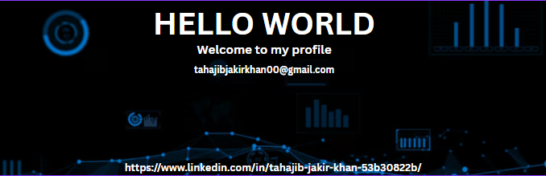

<!--Banner-->

<!--Night Owl image-->

  

<!--🔥 Stylish Follow Button -->

  

<!--Header Name-->
#  ɪ'ᴍ Tahajib! 
*Data Science & machine Learning Enthusiast*
  

<!--Start Intro-->               

I am a passionate explorer in the fields of Data Science and Machine Learning. I thrive on building intelligent solutions that bridge data with real-world impact. 

- ✨ Student of life :)
- 🌱 I’m currently learning many things in the field of AI.. I believe that every day is a learning opportunity.
- ❤ Contributing to Open Source.
- 💻 Visit my [Portfolio](https://kiran1689.github.io) for more details about me.
<!--End Intro-->

<!--Languages and Tools Section-->       
<h2 align="center">TECH STACK & LATEST ACTIVITY</h2> 
<picture>
  <source media="(prefers-color-scheme: dark)" srcset="./Skills_Animation_Dark.gif">
  <source media="(prefers-color-scheme: light)" srcset="./Skills_Animation_White.gif">
  
</picture>
 

<h3 align="left">Current Learning</h3>
<ul align="left">
  <li>Advancing my expertise in Machine Learning, with a focus on Federated Learning and privacy-preserving AI </li>
  <li>Exploring Generative AI using Hugging Face, LangChain, and large language models for multilingual and real-world applications.</li>
  <li>Building intelligent systems that integrate deep learning with real-world data in agriculture and sustainability.</li>
</ul>

 
 
 
 
 
 

<!--🏆 GitHub Trophies Section 🏆-->
<h2 align="center">🏆 Gɪᴛʜᴜʙ Tʀᴏᴘʜɪᴇs 🏆</h2>

  <a href="https://github.com/Tahajibjakir">
    <picture>
      <source media="(prefers-color-scheme: dark)" srcset="https://github-profile-trophy.vercel.app/?username=Tahajibjakir&no-bg=true&row=2&column=6&margin-w=20&margin-h=20&theme=monokai">
      <source media="(prefers-color-scheme: light)" srcset="https://github-profile-trophy.vercel.app/?username=Tahajibjakir&no-bg=true&row=2&column=6&margin-w=20&margin-h=20">
      
    </picture>
  </a>

 

<h2 align="left" id="prosenjit07-tech">Favorite Technologies</h2>

> These are the tools, languages, and platforms I enjoy using the most when building and exploring new ideas.

<table>
  <tr>
    <td align="center" width="98">
      
       Python
    </td>
    <td align="center" width="98">
      
       PyCharm
    </td>
    <td align="center" width="98">
      
       Google Colab
    </td>
     <td align="center" width="98">
   Anaconda
    </td>
    <td align="center" width="98">
      
       AWS
    </td>
    <td align="center" width="98">
   Power BI
    </td>
    <td align="center" width="98">
       Tableau
    </td>
    <td align="center" width="98">
       Excel
    </td>
  </tr>
  <tr>
    <td align="center" width="98">
      
       TensorFlow
    </td>
    <td align="center" width="98">
      
       Jupyter Notebooks
    </td>
    <td align="center" width="98">
      
       Apache Hadoop
    </td>
    <td align="center" width="98">
      
       Hugging Face
    </td>
    <td align="center" width="98">
   MySQL
    </td>
    <td align="center" width="98">
      
       Git
    </td>
    <td align="center" width="98">
      
       C
    </td>
    <td align="center" width="98">
      
       Arduino
    </td>
    
  </tr>
  <tr>
    <td align="center" width="98">
      
       HTML5
    </td>
    <td align="center" width="98">
      
       CSS3
    </td>
    <td align="center" width="98">
      
       VS Code
    </td>
    <td align="center" width="98">
      
       Adobe Photoshop
    </td>
  </tr>
</table>

<!--📊 GitHub Stats Table-->
<h2 align="center">📊 Gɪᴛʜᴜʙ Sᴛᴀᴛs 📊</h2>

<table width="100%">
  <tr>
    <td width="50%">
      <h3 align="center"><strong>Gɪᴛʜᴜʙ Sᴛᴀᴛs</strong></h3>
      

        
      

    </td>
    <td width="50%">
      <h3 align="center"><strong>Sᴛʀᴇᴀᴋ Sᴛᴀᴛs</strong></h3>
      

        
      

    </td>
  </tr>
  <tr>
    <td width="50%">
     <h3 align="center"><strong>Lᴀᴛᴇsᴛ Pʀᴏᴊᴇᴄᴛ</strong></h3>
      

        
    

</td>
    <td width="50%">
      <h3 align="center"><strong>Tᴏᴘ Cᴏɴᴛʀɪʙᴜᴛɪᴏɴs</strong></h3>
      

        
      

    </td>
  </tr>
</table>
 

<h2 align="center" style="color:#a3607d; font-weight: 700; font-family: 'Segoe UI', Tahoma, Geneva, Verdana, sans-serif;">
  📈 Cᴏɴᴛʀɪʙᴜᴛɪᴏɴ Gʀᴀᴘʜ 📈
</h2>

  

<!--Dynamic Quote card updates every day at 12 PM--> 
<h2 align="center">🌟 Tʜᴏᴜɢʜᴛ ᴏғ ᴛʜᴇ Dᴀʏ 🌟</h2>

<!--STARTS_HERE_QUOTE_CARD-->

    

<!--ENDS_HERE_QUOTE_CARD-->

<!--Contact Section--> 

<h2 align="center">🤝 Cᴏɴɴᴇᴄᴛ Mᴇ 🤝 </h2>

  
  

  

  

  

 

<!--Buy me a coffee-->

<!--Footer--> 

  

